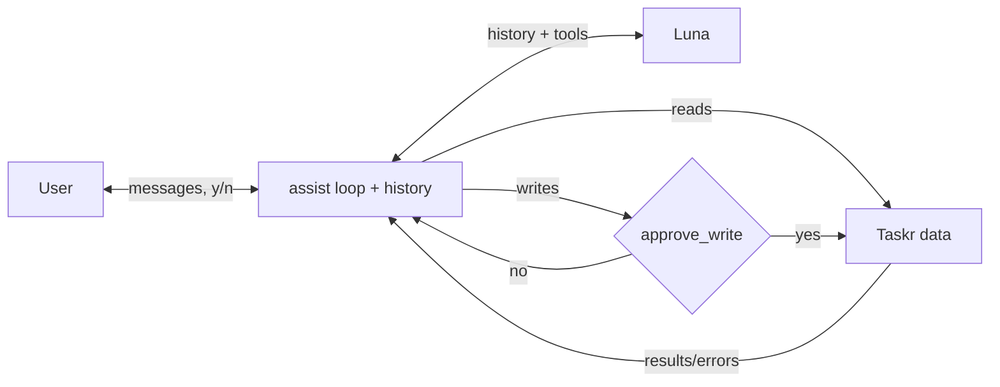

# My Taskr design

## 1. The user's problem

Tomorrow has fixed class and a meeting, and more task time than free time. Some
tasks overlap and some estimates are wrong. The user decides what fits and what
gets pushed, and Taskr is updated once they agree.

1. User: tomorrow is overloaded, help me plan
2. Assistant: ~3 free hours, ~6 hours of work. Does "get ready for demo" cover slides and rehearsal?
3. User: yes, and the assignment only needs 2 more hours
4. Assistant: proposes a block. User says no and gives new info
5. Assistant: revises the plan, user approves, it reports what changed

## 2. Categorize

One request with every uncategorized task's id and title. The prompt asks for
JSON only, `{"id": "school|work|personal|other"}`, with "other" if unsure. Code
drops unknown ids, already categorized tasks and bad categories, saves the rest,
and prints what was skipped. Bad JSON gets one retry, then nothing is saved. One
request is enough since ~150 titles fit easily. It's fixed code, not an action,
because the steps never change and the model only needs to answer.

## 3. Actions

| Action | When the model uses it | Arguments | What it returns | How it fails |
|---|---|---|---|---|
| find_tasks | look up tasks | due_from, due_to, status, title_contains, limit | matching tasks (max 50) | bad date |
| list_events | check calendar | start, end | events in range | bad timestamp |
| add_task | new work | title, minutes, priority, due | new task | bad field |
| update_task | change estimate/status | id, changes | updated task | unknown id |
| put_event | add or move a block | title, start, end, task_id, event_id | saved event | conflict, fixed, outside 9–18 |
| remove_event | remove a block | event_id | removed event | unknown id, fixed |

Code checks the tool name and args first, and errors go back to the model. The
last four are writes and call the store functions with the same names. Reads
filter `store.tasks()` and `store.events()` in code. The prompt includes today's
date and timezone from scenario.json, so the model turns "last Wednesday" into a
date range for find_tasks, and says which dates it used if the wording is unclear.

## 4. The loop and when it stops

Run each tool call and add one tool message per call, errors and denials
included, then call the model again. A reply with no tool calls ends the turn.
The limit is 12 model calls per turn, after which it stops and tells the user
what's unfinished. On a RuntimeError or 502, retry once, then tell the user and
keep the history.

## 5. Permissions

Every write goes through `approve_write()`. Ask mode shows the action and args
and takes y/n plus an optional reason. A no skips the write and the model gets
`{"status": "denied", "reason": ...}`. `--bypass` auto-approves. Reads never ask.
Rules the store doesn't check are in the system prompt, and the user approves
every change anyway.

## 6. Conversation state

The full message list is kept and sent every call, so new info revises the plan
instead of restarting it. Taskr stays the source of truth. The user replies at
`you>` and types `quit` to end.

## 7. Diagram

The user owns approvals, the code owns the history and loop, and Taskr owns the data.

## 8. One alternative, and your increments

Rejected: one get_all_tasks tool. At ~25K tokens it only fits once under the 32K cap.

1. [Categorize](../specs/01-categorize.md)
2. [Read tools + loop](../specs/02-read-loop.md)
3. [Writes + permissions](../specs/03-writes.md)
4. [Failures + limits](../specs/04-failures.md)
5. [History questions + live run](../specs/05-live.md)
